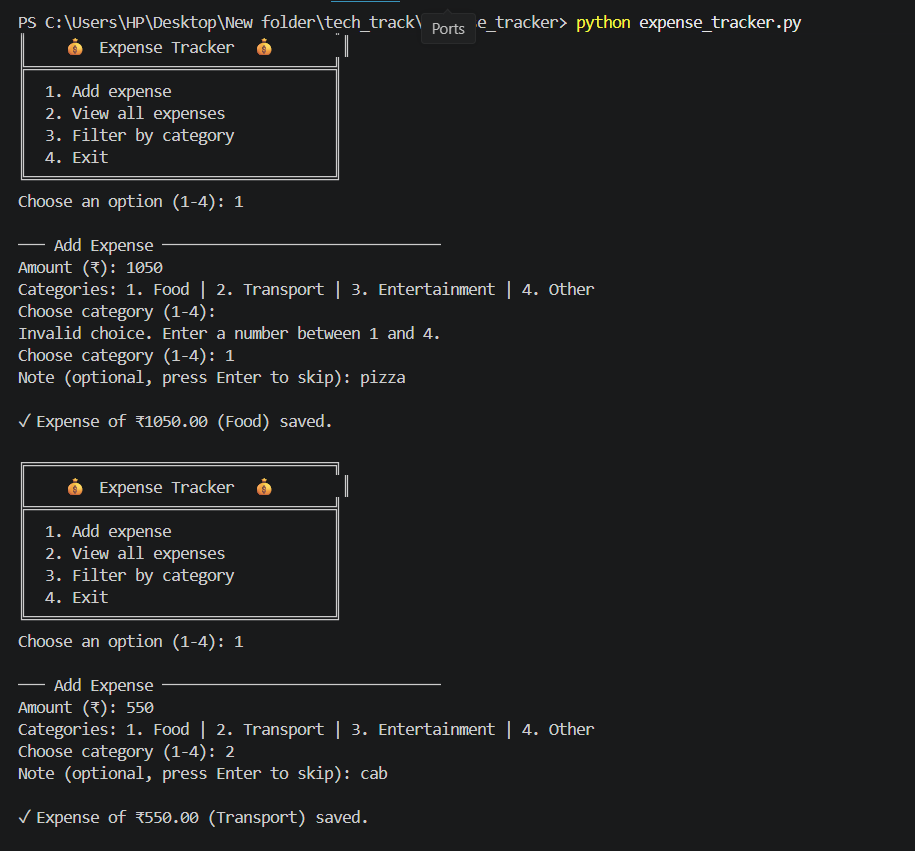
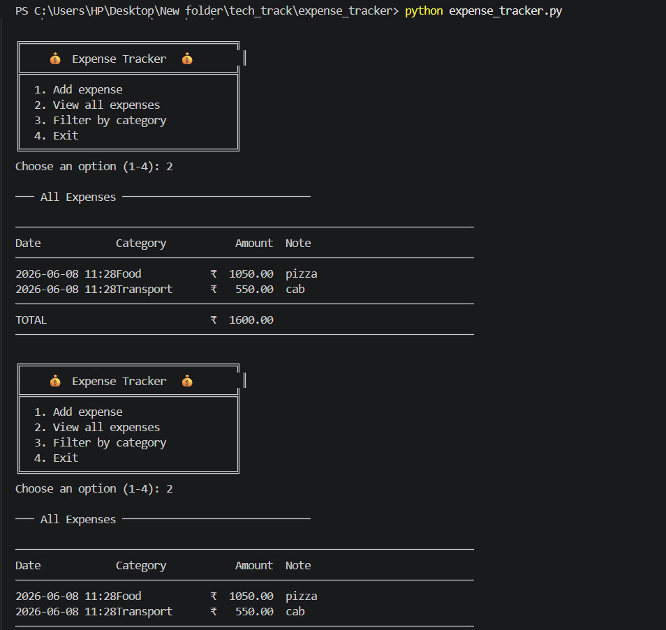
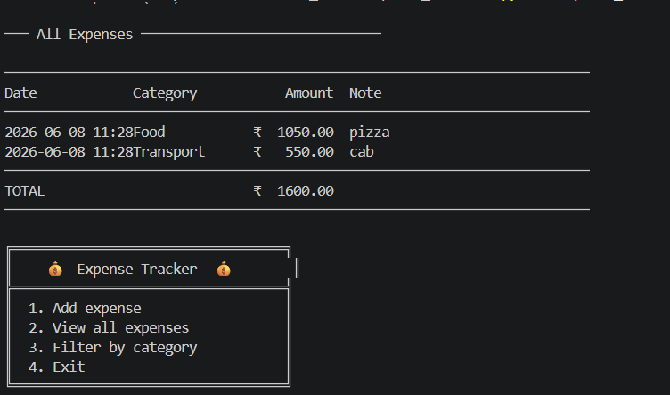

# 💰 CLI Personal Expense Tracker

A terminal-based expense tracker built with pure Python (no external libraries).  
Track your daily spending by category, view your history, and filter by type — all from the command line.

---

## What it does

- **Add an expense** — enter an amount, pick a category (Food / Transport / Entertainment / Other), and optionally add a note. Data is saved to a local JSON file so it persists between runs.
- **View all expenses** — displays a formatted table with date, category, amount, and note, plus a running total at the bottom.
- **Filter by category** — select a category and see only those entries with a subtotal.

---

## How to run it

Make sure you have Python 3 installed.

```bash
python expense_tracker.py
```

Use the numbered menu to navigate:

```
╔══════════════════════════════════╗
║    💰  Expense Tracker  💰        ║
╠══════════════════════════════════╣
║  1. Add expense                  ║
║  2. View all expenses            ║
║  3. Filter by category           ║
║  4. Exit                         ║
╚══════════════════════════════════╝
```

---

## Project structure

```
expense-tracker/
├── expense_tracker.py   # main program
├── .gitignore
└── README.md
```

> `expenses.json` is created automatically on first use and is excluded from version control via `.gitignore`.

---

## Screenshot





---

## Built for

SAE DTU · ForgeTrack 2026 · Tech Track · Week 01
